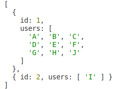

# Clustering algorithm for BLOC514

This repository holds an clustering algorithm for UNIC course BLOC514 assignment 1 part B.

## How the algorithm works

The clustering algorithm takes initially an input of a desired number of clusters for the given data. The given data is hardcoded and taken from the assignment 1 part B. It contains an array of users each holding an array of numbers of transfers to different addresses. The data has two missing values, which have to be handled. There are of course many different possible approaches. The missing values could simply be ignored or replaces with a median value or a default value for the column. Each method has its drawbacks. I decided to replace the missing values with the default number value (zero).

A cluster is a set of users with similar data. I decided to introduce two parameters to evaluate if users are similar. The first parameter is the _matchRange_. We look at the transfers to a specific address (i.e. Addr.#2) and compare the number of transfers of each user with the other users. The transfers to the specific address is considered to be a match if the values have a maximum difference defined as the match range (x + _matchRange_ <= y => x - _matchRange_). This check is applied to each number of transfers to each address. The second parameter is _requiredMatches_, which indicates how many matches two users must have at least to be considered as partners (having similar transfer data).

As an example we define a _matchRange_ of 3 and _requiredMatches_ of 2. If we look at userB and userC, we can see that they have 5 matches (Addr.#1, Addr.#2,Addr.#3,Addr.#4,Addr.#6). For Addr.#5 and Addr.#7 is the difference between the two values too great (6 and 5). Because 5 matches are clearly more than 2 required matches, the two users are considered to be partners, which means they are in the same cluster.

The designed and implemented algorithm has a **unique user-to-cluster assignment**. Due to the matching parameters it is not possible to have different clusters for the same number of clusters. The algorithm will always have the same users in the same clusters for the same number of clusters. Due to the fact, that the matching parameters can be recursively adjusted, the algorithm **works for different number of clusters**.

## Limitations

The algorithm can be used with different number of clusters as input parameter. It runs recursively and adjusts the matching parameters for each run. Because there are only two matching parameters and a limited amount of data, the precision is limited and the algorithm does not find a solution for any number of clusters. The algorithm would be better with more parameters for the matching engine. For example, it would be possible to weight addresses with zero transfers differently than addresses with transfers.

## Outcomes

By inputting different numbers of clusters the algorithm results in the following outcomes:

### 1 Cluster

### 2 Cluster

### 4 Cluster

### 7 Cluster

### 8 Cluster

### 10 Cluster

